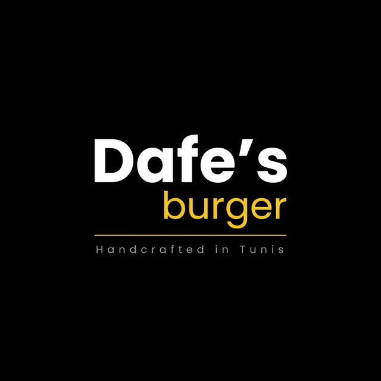

# 🍔 Berger-in-Motion — Premium Astro Template

A high-performance, animation-driven restaurant template built with **Astro 5.0**, **Tailwind CSS 4.0**, and **GSAP**. This template is designed for businesses that want a strong visual identity with fluid, premium interactions.



## 🚀 Technical Stack

- **Framework:** [Astro 5](https://astro.build/) (Static Site Generation for ultra-fast performance)
- **Styling:** [Tailwind CSS 4](https://tailwindcss.com/)
- **Animations:** [GSAP](https://gsap.com/) (ScrollTrigger, staggered animations, state-driven transitions)
- **State Management:** Minimalist vanilla JS Store (`src/store.ts`) for cross-component interactions.
- **UX:** [Astro View Transitions](https://docs.astro.build/en/guides/view-transitions/) for seamless multi-page routing.

## 🛠️ Key Features

- **Snap Scroll Home:** A smooth, app-like scroll experience for landing sections.
- **Data-Driven Burger Interaction:** A fully animated, "exploded" burger component controlled by a central store.
- **Dynamic Floating Elements:** Interactive chips and background effects that react to site state.
- **SEO Optimized:** Comprehensive Open Graph (OG), Twitter, and meta-tag support.
- **Template Architecture:** All content is extracted into data files for easy white-labeling.

## 📂 Project Structure & Customization

The site is built to be a template. You can customize the entire experience by editing these files:

### 1. Global Configuration (`src/config/`)

- **`site.ts`**: Brand name, SEO description, and social media handles.
- **`navigation.ts`**: Link paths and labels for the navigation dots and main menu.

### 2. Content Data (`src/data/`)

- **`burgerLayers.ts`**: Edit burger ingredients, caloric info, and stack order.
- **`chipsData.ts`**: Adjust the number, size, and positions of the floating chips.
- **`home.ts`**: Titles, colors, and vertical "decorative" text for landing sections.
- **`menu.ts`**: Full menu items, pricing, tags, and category lists.
- **`testimonials.ts`**: Customer reviews and rating summaries.
- **`about.ts`**: The brand story, mission, and stats.

## 🏁 Getting Started

1.  **Clone & Install:**
    ```bash
    npm install
    ```
2.  **Start Development:**
    ```bash
    npm run dev
    ```
3.  **Build for Production:**
    ```bash
    npm run build
    ```

## 📝 License

Distributed under the MIT License. See `LICENSE` for more information.

---

_Made with 🔥 by Antigravity_
